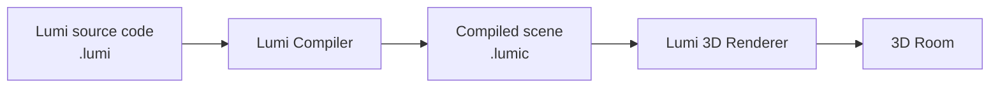
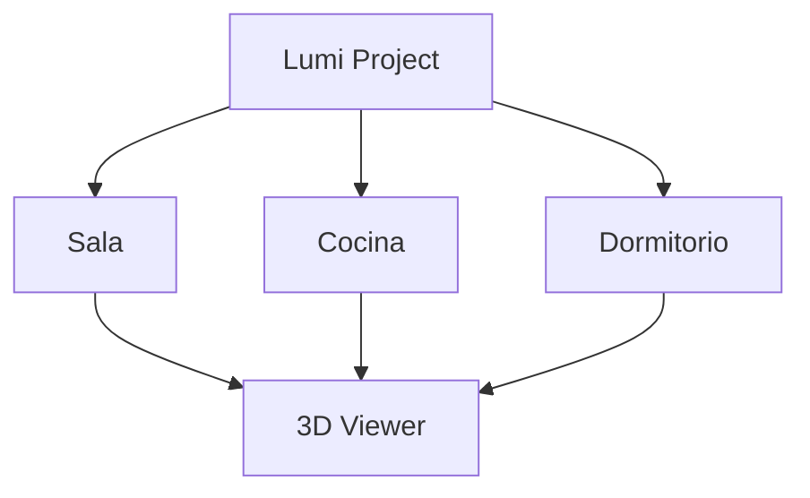
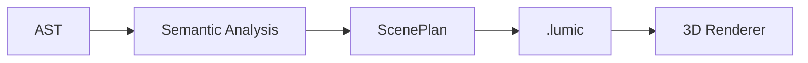
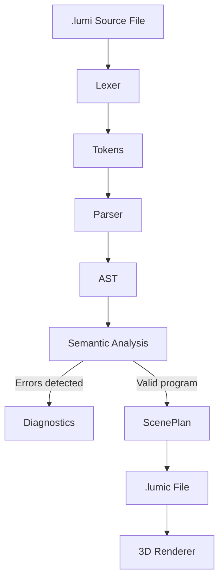
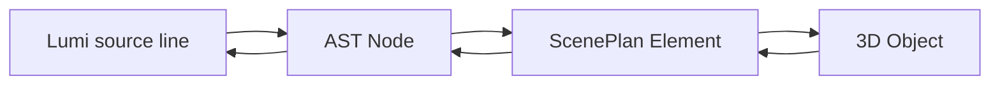
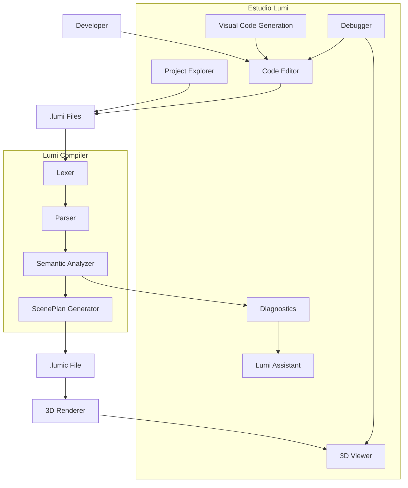

# Lumi & Estudio Lumi

**Lumi** is a domain-specific programming language designed to create and configure independent 3D rooms through code.

**Estudio Lumi** is the dedicated development environment for writing, validating, compiling, debugging, and visualizing Lumi projects.

The main goal of the project is to provide a simple programming experience in which code has an immediate visual representation in a 3D environment.

---

##  Project Overview

A Lumi project is composed of one or more `.lumi` source files.

Developers write Lumi code describing rooms, objects, positions, properties, and program logic. Estudio Lumi processes that code through the Lumi compiler.

When compilation succeeds, the compiler generates a `.lumic` file containing the compiled representation of the 3D scene.

The Lumi 3D renderer reads this compiled representation and displays the resulting room.



---

#  Lumi Programming Language

Lumi is focused specifically on the creation of simple 3D rooms and their contents.

Instead of requiring developers to manually implement rendering systems or complex 3D engines, Lumi provides language structures specifically designed for describing spaces.

A project may contain multiple independent rooms.

For example:

```lumi
habitacion sala(5.0, 4.0, 2.7) {

}
```

This defines a room named `sala` with its corresponding dimensions.

---

##  Multiple Rooms

A Lumi project can contain several independent rooms.

For example:

```text
MyProject/
│
├── principal.lumi
├── sala.lumi
├── cocina.lumi
└── dormitorio.lumi
```

The rooms do not need to be physically connected.

Estudio Lumi can allow the developer to select which room is currently displayed in the 3D viewer.



Only the selected room needs to be active in the viewer at a given moment.

---

# `.lumi` Source Files

`.lumi` is the source-code extension of the Lumi programming language.

These files contain the code written by the developer.

Example:

```lumi
habitacion sala(5.0, 4.0, 2.7) {

    // Lumi code

}
```

A project may contain multiple `.lumi` files to organize its code.

Imports are limited to `.lumi` files belonging to the same project.

This allows functionality to be divided into different files while keeping dependency resolution controlled by the Lumi project.

---

#  `.lumic` Compiled Files

`.lumic` is the compiled representation generated by the Lumi compiler.

Developers do not normally write `.lumic` files manually.

The process is:

```text
.lumi source code
        |
        v
   Lumi Compiler
        |
        v
.lumic compiled scene
        |
        v
   3D Renderer
```

The `.lumic` file contains the information required by the renderer to reconstruct the compiled scene.

This may include information such as:

* Room definitions
* Room dimensions
* Objects
* Object types
* Object positions
* Object properties
* Lighting information
* Camera information
* Scene metadata
* Source references required for debugging

The exact internal format is defined by the Lumi compiler specification.

---

#  ScenePlan

Before producing the final `.lumic` representation, the compiler builds a structured description of the scene called **ScenePlan**.

ScenePlan represents what must exist in the 3D environment after the Lumi source code has been successfully analyzed.

Conceptually:



A ScenePlan may contain:

```text
ScenePlan
│
├── Room
│   ├── Name
│   ├── Width
│   ├── Length
│   └── Height
│
├── Objects
│   ├── Type
│   ├── Position
│   └── Properties
│
├── Lights
│
├── Camera
│
└── Source references
```

This separation prevents the 3D renderer from needing to understand Lumi source code directly.

The renderer only needs to understand the compiled scene representation.

---

#  Compilation Process

The Lumi compiler transforms source code into a scene that can be rendered.



### Lexer

The lexer reads Lumi source code and converts it into tokens.

A token contains at least:

* Type
* Lexeme
* Source file
* Line
* Column

This information allows later compiler stages to identify exactly where each element originated.

---

### Parser

The parser receives the tokens generated by the lexer and verifies that they follow Lumi's grammar.

It then creates an **Abstract Syntax Tree (AST)**.

For example:

```lumi
entero cantidad = 5>>
```

may conceptually become:

```text
VariableDeclaration
│
├── Type: entero
├── Name: cantidad
└── Value: 5
```

---

### Semantic Analysis

Semantic analysis verifies that code is meaningful according to Lumi's rules.

Examples include:

* Variables must exist before they are used.
* Operations must use compatible types.
* Functions must receive valid parameters.
* Objects must use valid properties.
* References must resolve correctly.
* Room and scene operations must respect Lumi's rules.

If a problem is detected, a diagnostic is generated.

---

#  Diagnostics

Lumi uses a consistent diagnostic system for errors and warnings.

A diagnostic can contain:

```text
Code
Severity
Message
File
Line
Column
```

For example:

```text
LUMI-203

Type: Error
File: principal.lumi
Line: 8
Column: 18

Cannot assign a text value to an integer variable.
```

Because tokens and AST nodes preserve source locations, Estudio Lumi can associate compiler errors with the corresponding source code.

---

#  Basic Language Features

Lumi is intended to provide the fundamental programming concepts required to create interactive 3D-room programs.

The language may include:

* Variables
* Basic data types
* Arithmetic operations
* Comparison operations
* Logical operations
* Conditional statements
* Loops
* Functions
* Lists
* Null values
* Input
* Output
* Multiple source files
* Imports within the same Lumi project
* 3D-specific structures and instructions

---

#  Null Value

Lumi includes `nulo` to represent the absence of a value.

For example:

```lumi
texto nombre = nulo>>
```

The value can be checked explicitly:

```lumi
si (nombre == nulo) {
    mostrar("No name has been assigned")>>
}
```

`nulo` is not treated as:

* A number
* A condition
* A list index

It is primarily intended to represent the controlled absence of a value.

---

#  Lists

Lists allow developers to group multiple values or objects.

For example:

```lumi
lista habitaciones = [
    sala,
    cocina,
    dormitorio
]>>
```

Lists are useful when a program needs to work with collections of elements rather than individual values.

---

#  Input and Output

Lumi supports interaction with the user through input and output operations.

A simple output example is:

```lumi
mostrar("Welcome to Lumi")>>
```

Input can also affect the 3D experience.

For example, a program could allow the user to select a room:

```lumi
texto habitacion = seleccionar(
    "Seleccione una habitación:",
    ["Sala", "Cocina", "Dormitorio"]
)>>

cambiarHabitacion(habitacion)>>

mostrar("Habitación actual: " + habitacion)>>
```

This allows user input to produce a visible change in the 3D environment.

---

#  Imports

Imports are limited to `.lumi` files inside the same Lumi project.

Their purpose is to divide larger programs into multiple files and reuse functionality.

For example:

```text
MyProject/
│
├── principal.lumi
├── muebles.lumi
└── luces.lumi
```

A function defined in another file can be made available to the main program through Lumi's import mechanism.

The compiler must resolve both:

1. The referenced `.lumi` file.
2. The requested function or element inside that file.

External packages and Internet-based imports are outside the initial scope of Lumi.

---

#  Estudio Lumi

**Estudio Lumi** is the official IDE for the Lumi programming language.

It provides the tools required to create, edit, compile, debug, and visualize Lumi projects.

Its main areas include:

* Source-code editor
* Project/file explorer
* Compiler integration
* Diagnostics
* 3D viewer
* Room selection
* Code generation tools
* Debugging tools
* Lumi assistant

---

# Visual Code Generation

Estudio Lumi includes tools that can generate valid Lumi code automatically.

The minimum implementation provides:

**Insert → Room**

The IDE requests:

* Room name
* Width
* Length
* Height

For example:

```text
Name: sala
Width: 5.0
Length: 4.0
Height: 2.7
```

Estudio Lumi automatically inserts:

```lumi
habitacion sala(5.0, 4.0, 2.7) {

}
```

This functionality can later be expanded with generators for:

* Objects
* Furniture
* Lights
* Cameras
* Variables
* Functions
* Conditionals
* Loops

This feature does not replace programming. It generates valid Lumi code that the developer can continue editing manually.

---

#  3D Objects

Lumi is designed to support a predefined collection of common objects for room creation.

Possible initial objects include:

* Tables
* Chairs
* Lamps
* Televisions
* Paintings or wall decorations

Objects are positioned using coordinates.

A simplified conceptual example is:

```text
Object
├── Type: Table
├── X: 2.0
├── Y: 0.0
└── Z: 3.0
```

This keeps object placement explicit and predictable for the developer.

---

#  3D Coordinate System

Lumi scenes use a defined coordinate system for positioning elements.

The origin represents:

```text
(0, 0, 0)
```

Object positions are defined relative to this origin.

A consistent coordinate system is required so that Lumi source code, ScenePlan, `.lumic`, the debugger, and the renderer interpret positions identically.

---

#  Debugging

Estudio Lumi includes debugging support that connects source code with the resulting 3D scene.

The debugger maintains a relationship between:

* Lumi source files
* Source-code lines
* Compiled scene elements
* 3D objects

Conceptually:



This architecture can enable features such as selecting an object in the 3D viewer and identifying the source code responsible for creating it.

It can also allow Estudio Lumi to highlight a 3D object associated with a specific source-code location.

---

#  Lumi Assistant

Lumi is also the visual identity and assistant of Estudio Lumi.

The Lumi mascot can be used to communicate IDE states such as:

* Successful compilation
* Compilation errors
* Warnings
* Loading
* Helpful information
* Contextual assistance

The mascot is also used as the main visual identity and desktop application icon for Estudio Lumi.

---

#  Technical Contracts

To ensure that every component of the project communicates consistently, Lumi defines a set of technical contracts.

### Contract 0 — Lumi Language Specification

Defines the official syntax and semantic rules of the Lumi programming language.

### Contract 1 — Token

Defines the minimum information contained in every token:

* Type
* Lexeme
* File
* Line
* Column

### Contract 2 — AST Nodes

Defines the structure and minimum properties required by the Abstract Syntax Tree nodes.

### Contract 3 — Diagnostic

Defines a uniform representation for compiler errors and warnings.

### Contract 4 — CompilerService

Defines the public interface used by Estudio Lumi to communicate with the compiler.

### Contract 5 — ScenePlan and `.lumic`

Defines the structure of the compiled scene representation and the format consumed by the Lumi 3D renderer.

### Contract 6 — Debugger and 3D Source Mapping

Defines how the debugger relates each 3D object to the Lumi source code responsible for creating it.

---

# System Architecture

The complete system can be summarized as follows:



---

#  Main Development Workflow

A typical Lumi workflow is:

1. Create or open a Lumi project.
2. Create one or more `.lumi` files.
3. Write Lumi source code.
4. Use Estudio Lumi tools when desired to generate code templates.
5. Compile the project.
6. The lexer converts source code into tokens.
7. The parser creates the AST.
8. Semantic analysis validates the program.
9. Compilation errors are displayed as diagnostics when necessary.
10. A valid program is converted into ScenePlan.
11. ScenePlan is compiled into `.lumic`.
12. The Lumi 3D renderer loads the compiled scene.
13. Estudio Lumi displays the resulting room.
14. The developer can select different rooms and inspect the relationship between code and 3D elements.

---

#  Project Scope

The initial version of Lumi focuses on providing a controlled environment for learning and experimenting with programming through simple 3D-room creation.

The project intentionally prioritizes:

* Simple syntax
* Clear compiler errors
* Immediate visual feedback
* Predictable 3D behavior
* Integration between code and visualization
* A dedicated development environment
* A manageable initial language specification

Advanced features can be incorporated in future versions without unnecessarily increasing the complexity of the first implementation.

---

#  Project Philosophy

Lumi is based on a simple idea:

> **Write the space. Compile it. See it.**

The language, compiler, IDE, and renderer are designed as parts of the same development experience, allowing programmers to move naturally between source code and its visual 3D representation.
